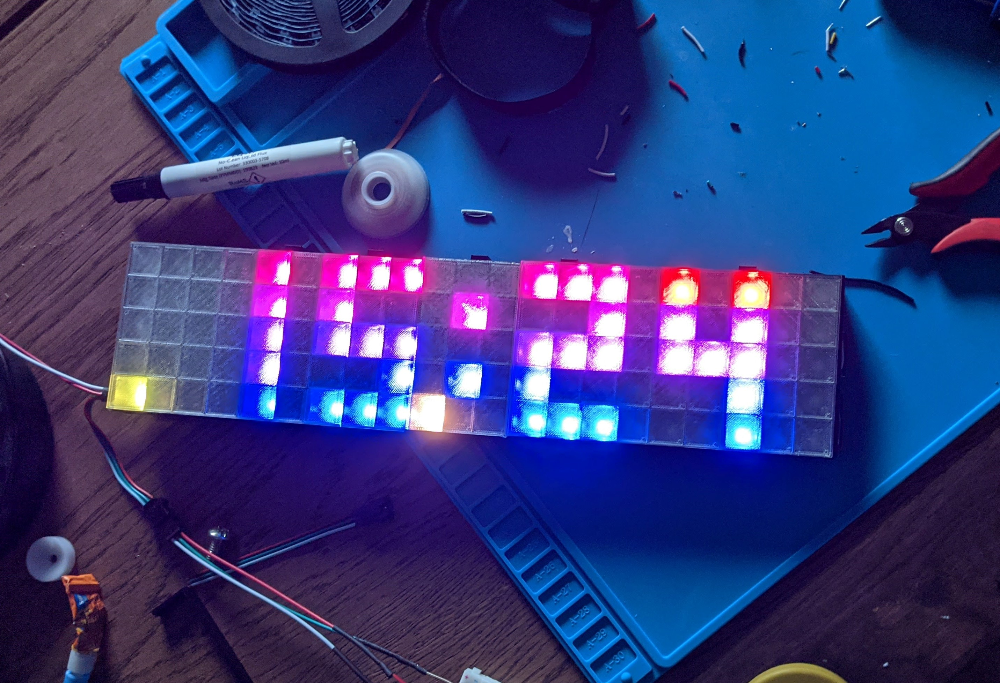

# LED Clock

This was originally forked from [https://github.com/Johboh/snapshots/tree/main/led_clock](Johboh/snapshots).

This repository is my Arduino source code for an LED clock with [3D printed parts](https://www.prusaprinters.org/prints/67594-shelf-led-clock-with-snake).

